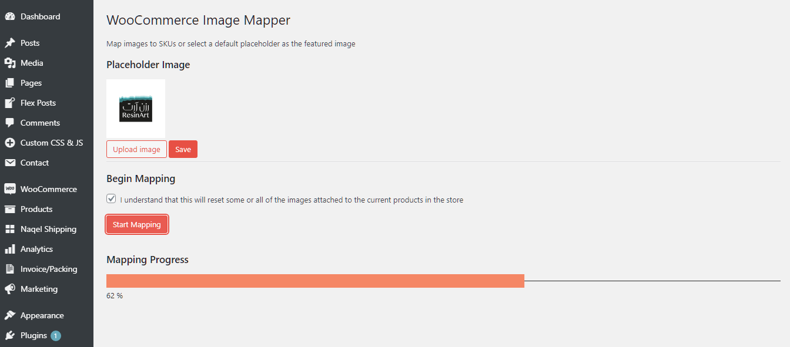

# WooCommerce SKU Image Mapper



Simple plugin used to map the featured images of products with images from the media library.

## Description

Removes the need to add featured products to multiple products. Just upload the images to your media library with the SKU as the name. If the image doesnt exist you can select a placeholder to set as the featured image.

## Getting Started

### Dependencies

* [Wordpress](https://wordpress.org/)
* [WooCommerce](https://woocommerce.com/)
* [ProgressBars.js](https://kimmobrunfeldt.github.io/progressbar.js/)

### Installation
* run `npm install`
* Create a .ZIP file and install it via the plugin installer
* Or upload the .ZIP file to your Wordpress plugin folder and extract it there


## Help

Edit the following in `admin/js/cm-prod-img-map-admin.ts` to modify your domain and sub domain

```typescript
const domain: string = location.origin
const subDomain: string = '/wordpress'
```

If you want to map products with images named after a different attribute or meta value, edit this line in `admin/class-cm-prod-img-map-admin.php`

```php
$sku = $product->get_sku();
$attach_id = $this->does_file_exists( $sku . '.jpg' );
```

## Authors
[Clinton D'souza](https://linkedin.com/in/clinton2111)

